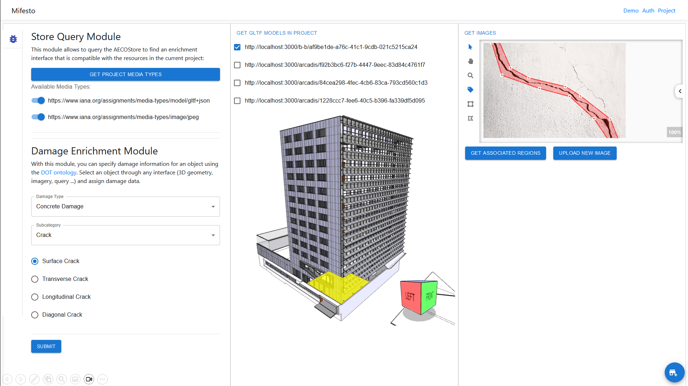

# Mifesto: Damage Module
This is a micro-frontend module that provides the means to enrich a federated ([Consolid](https://content.iospress.com/articles/semantic-web/sw233396)) multi-model with damage data, using the [DOT ontology](https://w3id.org/dot/). The user may select an element via any proxy (e.g. [geometric viewer](https://github.com/AECOstore/viewer-module), [image viewer](https://github.com/AECOstore/image-module), [SPARQL query](https://github.com/AECOstore/query-module)) and create a new RDF representation or load an existing one. The GUI is meant for demo purposes only, as a proof-of-concept for semantic enrichment of building data using any proxy resource. This module integrates a GUI component for dynamically loading proxy resources, depending on what is already available in the multi-model. E.g., if there are only images but no geometry yet, the [image viewer](https://github.com/AECOstore/image-module) will be loaded. 

## About Mifesto
Mifesto (Micro-Frontend Store) is an experimental framework for federation of micro-frontends. It is a work in progress and is not yet ready for production use. Micro-frontend modules expose the following: 

* a manifest file that describes the module and its dependencies
* loadable code which may be injected into a "bundler" application

The bundler application is responsible for loading the micro-frontend modules and providing a framework for them to interact with each other. The bundler application is also responsible for providing an interface for the micro-frontend modules to render into. Mifesto modules may or may not be compatible with the [ConSolid ecosystem](https://content.iospress.com/articles/semantic-web/sw233396), or generally with AEC multi-models. To be useful for interacting with multi-models, a minimal functionality is required. This functionality is described in the [Mifesto documentation]().